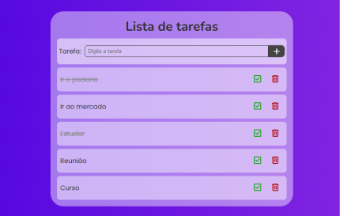
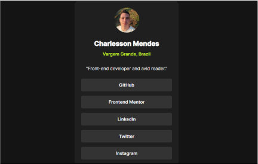

# Olá, eu sou Charlesson Mendes! 👋

Sou estudante de **Ciências da Computação** pela Universidade Estadual do Sudoeste da Bahia (UESB) e um entusiasta do desenvolvimento web. Minha jornada na programação começou com **Lógica de Programação** em **C++** e **Programação Orientada a Objetos** em **Java**, mas encontrei minha paixão no universo web e resolvi me aprofundar nessa área.

---

### 💻 Habilidades e Conhecimentos

Minhas principais habilidades são focadas no **desenvolvimento front-end**, com um entendimento sólido das tecnologias fundamentais.

**HTML:**
- **HTML Semântico:** Utilização de tags apropriadas para estruturar o conteúdo de forma acessível e otimizada para SEO.

**CSS:**
- **Box Model:** Compreensão completa do modelo de caixa para layouts e espaçamentos.
- **Flexbox e Grid:** Domínio das principais ferramentas de layout para criar designs responsivos e complexos.

**JavaScript:**
- **Fundamentos:** Funções de callback, objetos, arrays e seus métodos.
- **Conceitos Avançados:** Desestruturação, Closure.
- **DOM:** Manipulação da árvore DOM para interatividade e dinamismo nas páginas.
- **Estrutura de Projetos:** Compreensão do padrão MVC e organização de código.

---

### 🚀 Projetos Recentes

Aqui estão alguns dos meus projetos mais relevantes, todos desenvolvidos com **HTML, CSS e JavaScript puro**:

  
<b>Lista de Tarefas</b>

  
  Uma aplicação simples e funcional para gerenciar tarefas diárias. Permite adicionar, marcar como concluído e remover itens da lista.

  - **Link da aplicação:** [https://charlesson-mp.github.io/lista-de-tarefas/](https://charlesson-mp.github.io/lista-de-tarefas/)
  - **Repositório:** [https://github.com/Charlesson-MP/lista-de-tarefas](https://github.com/Charlesson-MP/lista-de-tarefas)
  
  

  
<b>Social Links Profile</b>

  
  Um card de perfil com links para minhas redes sociais, demonstrando habilidades de layout e estilo.

  - **Link da aplicação:** [https://charlesson-mp.github.io/social-links-profile-main/](https://charlesson-mp.github.io/social-links-profile-main/)
  - **Repositório:** [https://github.com/Charlesson-MP/social-links-profile-main](https://github.com/Charlesson-MP/social-links-profile-main)
  
  

  
<b>X-DEVS</b>

  
  Uma página com um carrossel de personagens, utilizando JavaScript para manipulação de eventos e a interface do usuário.

  - **Link da aplicação:** [https://charlesson-mp.github.io/projeto-x-devs/](https://charlesson-mp.github.io/projeto-x-devs/)
  - **Repositório:** [https://github.com/Charlesson-MP/projeto-x-devs](https://github.com/Charlesson-MP/projeto-x-devs)
  
  

---

### 📈 Planos Futuros

Meu foco atual é consolidar meus conhecimentos em **HTML, CSS e JavaScript**, além de aprimorar minhas habilidades com **Git** e **GitHub**. Em seguida, pretendo mergulhar em frameworks e bibliotecas modernas do universo front-end, como **React** ou **Vue.js**, para desenvolver soluções ainda mais robustas e escaláveis.

---

### 📞 Entre em Contato

- **LinkedIn:** [https://www.linkedin.com/in/charlesson-mendes-developer/](https://www.linkedin.com/in/charlesson-mendes-developer/)
- **Email:** charlessonmendes@gmail.com
Charlesson-MP/Charlesson-MP is a ✨ special ✨ repository because its `README.md` (this file) appears on your GitHub profile.
You can click the Preview link to take a look at your changes.
--->
